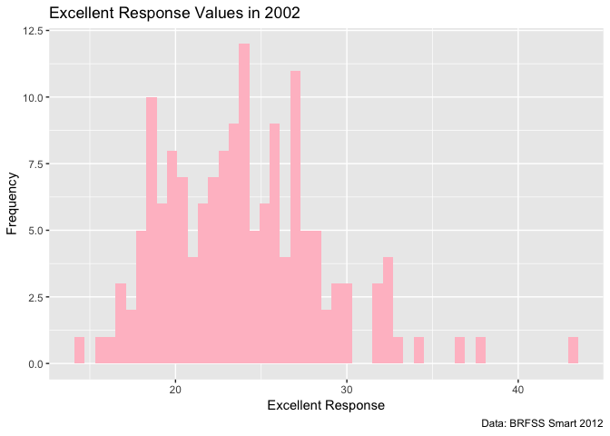
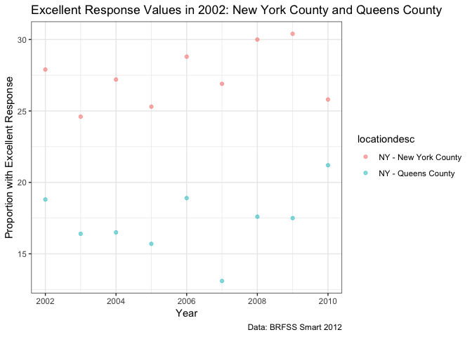

Homework 2
================
Jeanette Shekelle
10/5/2018

``` r
library(tidyverse)
```

    ## ── Attaching packages ────────────────────────────────────────────────────────────────────── tidyverse 1.2.1 ──

    ## ✔ ggplot2 3.0.0     ✔ purrr   0.2.5
    ## ✔ tibble  1.4.2     ✔ dplyr   0.7.6
    ## ✔ tidyr   0.8.1     ✔ stringr 1.3.1
    ## ✔ readr   1.1.1     ✔ forcats 0.3.0

    ## ── Conflicts ───────────────────────────────────────────────────────────────────────── tidyverse_conflicts() ──
    ## ✖ dplyr::filter() masks stats::filter()
    ## ✖ dplyr::lag()    masks stats::lag()

Problem 1
---------

Import NYC transit data. Read and clean the data; retain line, station, name, station latitude / longitude, routes served, entry, vending, entrance type, and ADA compliance. Convert the entry variable from character (YES vs NO) to a logical variable

``` r
NYC_transit_data = 
  read_csv(file = "./data/NYC_Transit_Subway_Entrance_And_Exit_Data.csv") %>%
  janitor::clean_names() %>%
  select (line, station_name, station_latitude, station_longitude, route1, route2, route3, route4, route5, route6, route7, route8, route9, route10, route11, entry, vending, ada) %>%
mutate (entry = recode(entry, "YES"= TRUE, "NO"= FALSE))
```

    ## Parsed with column specification:
    ## cols(
    ##   .default = col_character(),
    ##   `Station Latitude` = col_double(),
    ##   `Station Longitude` = col_double(),
    ##   Route8 = col_integer(),
    ##   Route9 = col_integer(),
    ##   Route10 = col_integer(),
    ##   Route11 = col_integer(),
    ##   ADA = col_logical(),
    ##   `Free Crossover` = col_logical(),
    ##   `Entrance Latitude` = col_double(),
    ##   `Entrance Longitude` = col_double()
    ## )

    ## See spec(...) for full column specifications.

Write a short paragraph about this dataset – explain briefly what variables the dataset contains, describe your data cleaning steps so far, and give the dimension (rows x columns) of the resulting dataset. Are these data tidy?

The dataset contains 18 variables: line, station name, station latitude, station longitude, route 1-11, entry, vending and ADA. So far, I imported the data, cleaned the names so they all have the same format (lowercase snake), selected which variables to keep, and converted the entry variable to a logical variable (true/false). The data has 1868 rows and 18 columns. These data are tidy: the rows are observations, the columns are variables, and every value has a cell.

How many distinct stations are there? Note that stations are identified both by name and by line (e.g. 125th St A/B/C/D; 125st 1; 125st 4/5);

``` r
nrow(distinct(NYC_transit_data, station_name, line))
```

    ## [1] 465

There are 465 dinstinct stations.

How many stations are ADA compliant?

``` r
nrow(filter(distinct(NYC_transit_data, station_name, line, ada), ada == TRUE))
```

    ## [1] 84

There are 84 ADA compliant stations among distinct stations.

What proportion of station entrances / exits without vending allow entrance?

``` r
nrow(filter(NYC_transit_data, vending == "NO", entry == TRUE)) / nrow(filter(NYC_transit_data, vending == "NO"))
```

    ## [1] 0.3770492

The proportion of station entrances / exits without vending but that allow entrance is 0.377.

Reformat data so that route number and route name are distinct variables.

``` r
NYC_transit_tidy_data = gather(NYC_transit_data, key = route_number, value = route_name, route1:route11)
NYC_transit_tidy_data
```

    ## # A tibble: 20,548 x 9
    ##    line  station_name station_latitude station_longitu… entry vending ada  
    ##    <chr> <chr>                   <dbl>            <dbl> <lgl> <chr>   <lgl>
    ##  1 4 Av… 25th St                  40.7            -74.0 TRUE  YES     FALSE
    ##  2 4 Av… 25th St                  40.7            -74.0 TRUE  YES     FALSE
    ##  3 4 Av… 36th St                  40.7            -74.0 TRUE  YES     FALSE
    ##  4 4 Av… 36th St                  40.7            -74.0 TRUE  YES     FALSE
    ##  5 4 Av… 36th St                  40.7            -74.0 TRUE  YES     FALSE
    ##  6 4 Av… 45th St                  40.6            -74.0 TRUE  YES     FALSE
    ##  7 4 Av… 45th St                  40.6            -74.0 TRUE  YES     FALSE
    ##  8 4 Av… 45th St                  40.6            -74.0 TRUE  YES     FALSE
    ##  9 4 Av… 45th St                  40.6            -74.0 TRUE  YES     FALSE
    ## 10 4 Av… 53rd St                  40.6            -74.0 TRUE  YES     FALSE
    ## # ... with 20,538 more rows, and 2 more variables: route_number <chr>,
    ## #   route_name <chr>

How many distinct stations serve the A train?

``` r
nrow(filter(distinct(NYC_transit_tidy_data, station_name, route_name, line), route_name == "A"))
```

    ## [1] 60

60 distinct stations serve the A train.

Of the stations that serve the A train, how many are ADA compliant?

``` r
nrow(filter(filter(distinct(NYC_transit_tidy_data, station_name, route_name, line, ada), route_name == "A"), ada == TRUE))
```

    ## [1] 17

Only 17 stations are ADA compliant of the stations that serve the A train.

Problem 2
---------

Read and clean the Mr. Trash Wheel sheet:

-   specify the sheet in the Excel file and to omit columns containing notes (using the range argument and cell\_cols() function)
-   use reasonable variable names
-   omit rows that do not include dumpster-specific data
-   rounds the number of sports balls to the nearest integer and converts the result to an integer variable (using as.integer)

``` r
library(readxl)
trash_wheel_data = read_excel("./data/HealthyHarborWaterWheelTotals2018-7-28.xlsx", "Mr. Trash Wheel", range = "A2:N338")  %>% 
janitor::clean_names() %>% 
    filter(!is.na(dumpster)) %>% 
mutate(sports_balls = round(sports_balls)) %>% 
  mutate(sports_balss = as.integer(sports_balls))
```

Read and clean precipitation data for 2016 and 2017. For each, omit rows without precipitation data and add a variable year. Next, combine datasets and convert month to a character variable (the variable month.name is built into R and should be useful).

``` r
precip_16 = read_excel("./data/HealthyHarborWaterWheelTotals2018-7-28.xlsx", "2016 Precipitation", range = "A2:B14")  %>% 
 janitor::clean_names() %>% 
  mutate(year = 2016)

precip_17 = read_excel("./data/HealthyHarborWaterWheelTotals2018-7-28.xlsx", "2017 Precipitation", range = "A2:B14")  %>% 
 janitor::clean_names() %>% 
  mutate(year = 2017)

precip_16_17= bind_rows(mutate(precip_16, month = month.name), mutate(precip_17, month = month.name))
```

The number of observations in the trash wheel dataset is 285. The number of variables is 15. In 2017, the total precipitation was 32.93. In 2016, the total precipitation was 39.95. The median number of sports balls in a dumpster in 2016 was 26.

Problem 3
---------

``` r
# install.packages("devtools")
devtools::install_github("p8105/p8105.datasets")
```

    ## Skipping install of 'p8105.datasets' from a github remote, the SHA1 (21f5ad1c) has not changed since last install.
    ##   Use `force = TRUE` to force installation

``` r
library(p8105.datasets)
```

``` r
data("brfss_smart2010")
```

For this question:

-   format the data to use appropriate variable names;
-   focus on the “Overall Health” topic
-   exclude variables for class, topic, question, sample size, and everything from lower confidence limit to GeoLocation
-   structure data so that values for Response (“Excellent” to “Poor”) are column names / variables which indicate the proportion of subjects with each response (which are values of Data\_value in the original dataset)
-   create a new variable showing the proportion of responses that were “Excellent” or “Very Good”

``` r
brfss_smart2010 = 
  brfss_smart2010 %>% 
   janitor::clean_names() %>% 
  filter(topic == "Overall Health") %>% 
  select(- class, - topic, - question, - sample_size, - (confidence_limit_low:geo_location)) %>% 
  spread(., key = response, value = data_value) %>% 
  janitor::clean_names() %>% 
  mutate(excellent_very_good = excellent + very_good)
```

How many unique locations are included in the dataset? Is every state represented? What state is observed the most?

There are 404 unique locations included in the dataset. Every state is represented; there are 51 unique values in the state abbreviation column. The state of NJ is observed the most.

-   In 2002, what is the median of the “Excellent” response value?

``` r
brfss_smart2010 %>% 
  filter(year == 2002) %>% 
  summarize(median(excellent, na.rm = TRUE))
```

    ## # A tibble: 1 x 1
    ##   `median(excellent, na.rm = TRUE)`
    ##                               <dbl>
    ## 1                              23.6

The median of the excellent response values is 23.6.

-   Make a histogram of “Excellent” response values in the year 2002.

``` r
brfss_smart2010 %>% 
  filter(year == 2002) %>% 
ggplot(aes(x = excellent)) + 
  geom_histogram(binwidth = 0.6, fill = "Pink") +
  labs(title = "Excellent Response Values in 2002", x = "Excellent Response", y = "Frequency", caption = "Data: BRFSS Smart 2012") +
  theme_gray()
```

    ## Warning: Removed 2 rows containing non-finite values (stat_bin).



-   Make a scatterplot showing the proportion of “Excellent” response values in New York County and Queens County (both in NY State) in each year from 2002 to 2010.

``` r
brfss_smart2010 %>% 
  filter(locationdesc == "NY - New York County" | locationdesc == "NY - Queens County") %>% 
  ggplot(aes(x = year, y = excellent)) +
geom_point(aes(color = locationdesc), alpha = .5) +
labs(title = "Excellent Response Values in 2002: New York County and Queens County", x = "Year", y = "Proportion with Excellent Response", caption = "Data: BRFSS Smart 2012") +
  theme_bw()
```


